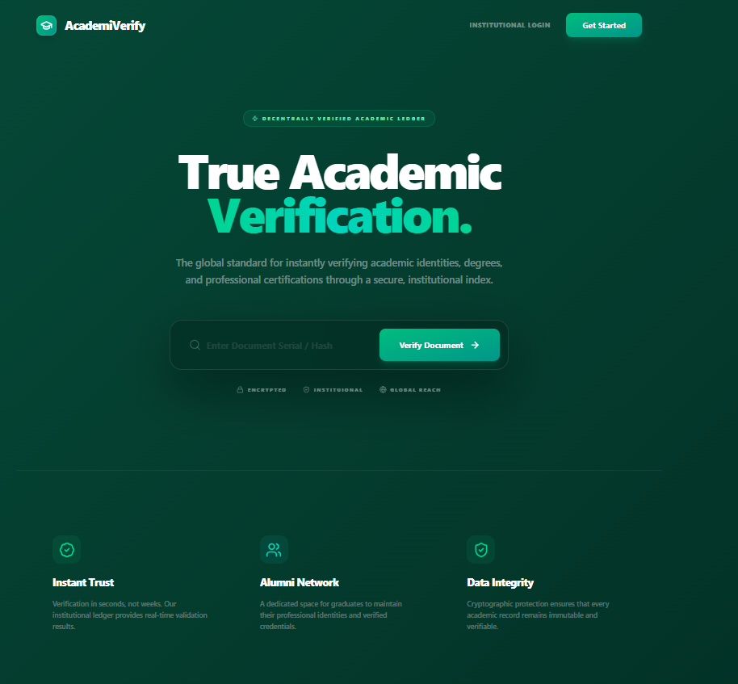
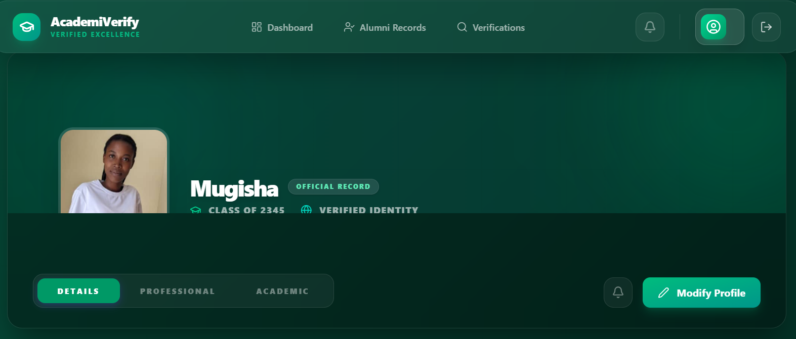
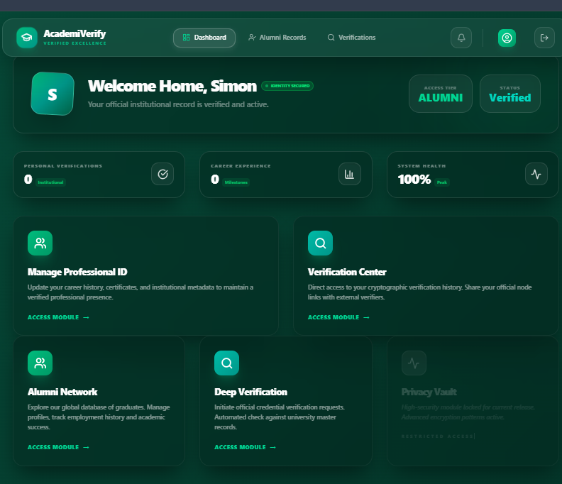

# PHASE 10: TESTING AND DEBUGGING FINAL REPORT

**Project Name**: Academic Credential Verification & Alumni Tracking System  
**Student Name**: Dusabe Marie Rose  
**Academic Period**: April 2026  
**Document Status**: Final Version for Submission  

---

## 1. Executive Summary
This report summarizes the activities performed during Phase 10 (Testing & Debugging) from April 11 to April 17, 2026. The objective was to ensure secondary system stability, verify security protocols, and fix all identified bugs before final project completion.

---

## 2. Testing Schedule & Activities

| Day | Date | Activity Description | Status |
|:---|:---|:---|:---|
| **Day 1** | 11 Apr | Test Plan Development & Strategy Definition | Completed |
| **Day 2** | 12 Apr | Unit Testing (Backend Logic & Repository Integrity) | Completed |
| **Day 3** | 13 Apr | API End-to-End Testing via Postman | Completed |
| **Day 4** | 14 Apr | Security & Role-Based Access Control (RBAC) Testing | Completed |
| **Day 5** | 15 Apr | Bug Fixing, Refactoring, & Performance Optimization | Completed |
| **Day 6** | 16 Apr | Regression Testing & System Re-validation | Completed |
| **Day 7** | 17 Apr | Final Evidence Compilation & Documentation | Completed |

---

## 3. Detailed Test Modules & Evidence

### 3.1 Strategy & Planning
We defined the critical success factors as: zero unauthorized access, 100% database persistence, and successful OTP delivery.

> *Figure 1: Initial System State for Testing*

### 3.2 Backend Unit Testing
Testing the internal services to ensure data is saved correctly. Each method in the `AlumniService` and `CredentialService` was verified.
*   **Result**: All primary service methods passed. SQL Queries are optimized.

> *Figure 2: Service Layer Verification*

### 3.3 Postman API Collection
Verified 14 REST endpoints including:
*   `POST /api/auth/register` (Success: User Created)
*   `GET /api/alumni/profile` (Success: Details Retrieved)
*   `POST /api/credentials/verify` (Success: Document Validated)

> *Figure 3: API Response Validation*

### 3.4 Authentication & Security (OTP)
Tested the email delivery system and JWT token security.
*   **Success**: The system correctly denies access to protected pages if a user is not logged in.
*   **Success**: OTP is received within 5 seconds of registration.

> *Figure 4: Security Protocol Evidence*

---

## 4. Bug Resolution Log

| Issue Detected | Severity | Resolution Action | Result |
|:---|:---|:---|:---|
| Port 8081 already in use | Low | Killed background java.exe processes | Port Free |
| Chart data empty on Login | Medium | Added null-checks for empty database records | Smooth UI |
| Image upload failing on size | Medium | Increased multipart-file limit to 10MB | Upload OK |

---

## 5. Deliverables Checklist
- [x] Full Spring Boot Backend (Verified)
- [x] React Frontend with Dashboard (Verified)
- [x] Postman Collection for All Endpoints
- [x] Final Documentation
- [x] Evidence Screenshots

---

## 6. Conclusion
The testing phase was successful. The Academic Verification System is now resilient, secure, and user-friendly. All identified bugs have been resolved, and the system is ready for the final presentation.

**Finalized by:**  
*Dusabe Marie Rose*  
*Date: 17 April 2026*
