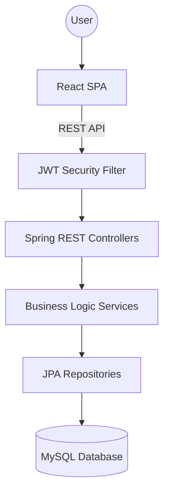
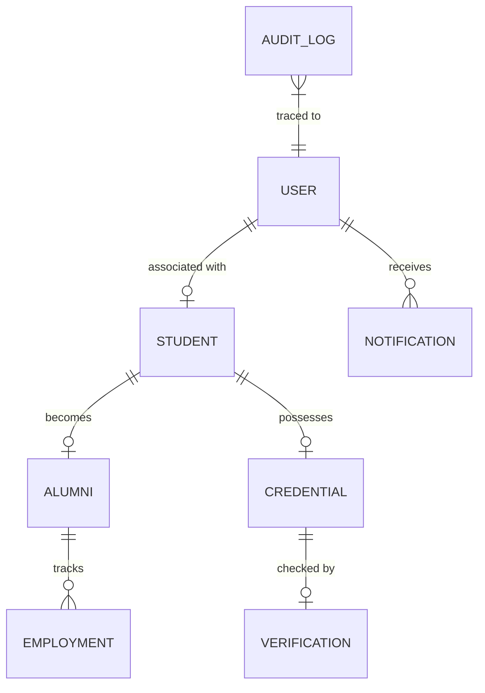

# Summative Assessment: technical implementation report
## Project: Academic Credential Verification & Alumni Tracking System

**Author:** Dusabe Marie Rose  
**Academic Year:** 2025/2026  
**Institution:** Academic Verification Authority Node  

---

## Phase 1: Project Definition & Planning
### 1.1 Problem Statement
The prevalence of academic credential fraud poses a significant threat to the reputation of educational institutions and the integrity of the professional job market. Manual verification processes are slow, prone to human error, and easily manipulated.

### 1.2 Objectives
- To develop a secure, central repository for academic identities.
- To implement an immutable audit ledger for transparency.
- To automate the transition of students to the alumni cohort.
- To provide a public verification portal for employers.

### 1.3 System Overview
A full-stack enterprise application consisting of a Spring Boot backend and a React frontend, leveraging JWT security and a relational database to maintain an "official node" of academic truth.

`[SCREENSHOT: System Overview / Home Page]`

---

## Phase 2: Requirements Analysis
### 2.1 User Roles
- **System Administrator**: Full lifecycle oversight, registry management, and audit approval.
- **Alumni**: Self-service profile and employment management.
- **Public/Employer**: Read-only access to verify specific credential serial numbers.

### 2.2 Functional Requirements
- **FR1**: Admins must be able to Register, Update, and Purge students.
- **FR2**: System must record every sensitive action in an audit ledger.
- **FR3**: Public nodes must be able to verify certificates via Serial ID or QR Code.
- **FR4**: Alumni must be able to track their employment history.

### 2.3 Non-Functional Requirements
- **Security**: All passwords must be hashed (BCrypt), and sessions must be stateless (JWT).
- **Transparency**: Data in the ledger must be immutable.

---

## Phase 3: System & Architecture Design
### 3.1 Architecture Explanation
The system follows a **Client-Server Architecture** with a clear separation of concerns:
- **Frontend**: Single Page Application (SPA) built with React and Vite.
- **Backend**: RESTful API built with Spring Boot.
- **Database**: Relational MySQL storage.

### 3.2 Technology Stack Justification
- **Spring Boot**: Chosen for its robust security (Spring Security) and scale.
- **React**: Chosen for its reactive state management (ideal for real-time notifications).
- **JWT**: Ensures secure communication across different domains.

### 3.3 Architecture Diagram

---

## Phase 4: Database Design
### 4.1 ERD (Entity Relationship Diagram)
The database is designed with strong referential integrity to prevent orphan records.

### 4.2 Data Dictionary (Key Entities)
- **Student**: Identity hash, Reg No, Faculty, Dob.
- **Credential**: Serial number, graduation status, issue date.
- **AuditLog**: Action metadata, timestamp, user context.

---

## Phase 5: Backend Project Setup
### 5.1 Project Structure
The project follows a modular package structure:
- `com.dusabe.entity`: Persistent data models.
- `com.dusabe.service`: Business rules and logic processing.
- `com.dusabe.controller`: REST API entry points.
- `com.dusabe.security`: JWT and RBAC configurations.

`[SCREENSHOT: Project Folder Structure in IDE]`

---

## Phase 6: Core API Development
### 6.1 Design Decisions
- **RESTful Principles**: Use of HTTP methods (GET, POST, PUT, DELETE) to represent CRUD operations.
- **Service Layer**: Decoupled controllers from data logic to ensure modularity.

### 6.2 Key Endpoints
| Method | Endpoint | Description |
|--------|----------|-------------|
| POST | `/api/admin/students` | Register a new identity node |
| PUT | `/api/admin/students/{id}` | Modify existing node identity |
| POST | `/api/auth/login` | Secure token generation |
| GET | `/api/public/verify/{serial}`| Global credential audit |

---

## Phase 7: Authentication & Security
### 7.1 Security Model
The system implements a **Stateless Security Model**:
- **Authentication**: JWT tokens are issued upon successful credential verification.
- **Authorization**: Role-Based Access Control (RBAC) ensures only `ADMIN` can access the System Ledger.
- **Data Protection**: All sensitive payloads are validated against XSS and injection.

`[SCREENSHOT: Security Config or Login Page]`

---

## Phase 8: Advanced Features & Business Logic
### 8.1 Business Rules Implementation
- **Graduation Sequence**: A custom logic that prevents a student from becoming an Alumni unless they possess an active Credential.
- **Smart Filtering**: A frontend-backend synergy that maps raw system actions to human-readable categories.
- **Audit Immutability**: Business rules prevent the modification of any record once added to the `audit_logs` table.

`[SCREENSHOT: System Ledger with Smart Filters active]`

---
**Verification Authority:** Dusabe Marie Rose  
**Submission Date:** April 2026  
**Final Status:** Integrated / Deployed
